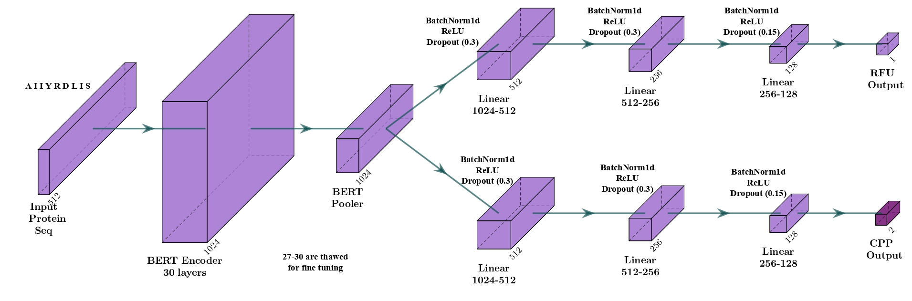

# ProtBERT-MTL: Modelo multitarea para análisis de Péptidos

## Descripción del proyecto

Este proyecto implementa ProtBERT basado en la arquitectura BERT para analizar propiedades de péptidos. Combina dos tareas principales:

1. **Predicción de RFU (Unidades de Fluorescencia Relativa)**: Tarea de regresión que estima valores de fluorescencia.
2. **Clasificación de CPP (Péptidos Penetradores de Células)**: Clasificación binaria para identificar péptidos con capacidad de penetración celular.

El modelo utiliza **ProtBERT**, un BERT pre-entrenado en secuencias de proteínas, adaptado mediante fine-tuning para las tareas específicas.

## Tabla de Contenidos

1. [Requisitos](#requisitos)
2. [Arquitectura](#arquitectura)
3. [Estructura del Código](#estructura-del-código)
4. [Implementación](#implementación)
5. [Uso](#uso)
6. [Resultados](#resultados)

## Requisitos

- **Python 3.7+**
- Bibliotecas principales:
  ```bash
  torch >= 1.10
  transformers >= 4.18
  scikit-learn >= 1.0
  pandas >= 1.3
  matplotlib >= 3.5
  seaborn >= 0.11
  ```

## Arquitectura



## Estructura del código

El proyecto sigue una arquitectura limpia organizada en módulos especializados:

```
BERT-MTL/
├── data/
│   └── dataset.py      # Dataset y preprocesamiento
├── model/
│   └── model.py        # Modelo y funciones de pérdida
├── training/
│   └── trainer.py      # Lógica de entrenamiento y evaluación
├── utils/
│   └── utils.py        # Funciones auxiliares
├── ProBERT_MTL.ipynb
└── README.md           # Documentación
```

### Módulos Principales

- **data/dataset.py**:

  - `MultiTaskPeptideDataset`: Clase para manejo de datos (secuencias de péptidos y etiquetas)

- **model/model.py**:

  - `BertMultiTaskModel`: Arquitectura principal del modelo
  - `FocalLoss` y `HuberLoss`: Funciones de pérdida especializadas

- **training/trainer.py**:

  - `train_improved`: Función principal de entrenamiento
  - `evaluate_improved`: Evaluación del modelo

- **utils/utils.py**:
  - Guardado/carga de checkpoints
  - Visualización de resultados
  - Análisis estadístico

### Implementación

- **Configuración del Modelo**:

  - Fine-tuning de las últimas 4 capas de ProtBERT
  - Cabezas de tarea específicas para RFU (regresión) y CPP (clasificación)
  - Pooling adaptativo (mean, cls o max)

- **Manejo de Datos**:
  - Tokenización especializada para secuencias de aminoácidos
  - Normalización de características RFU
  - Balanceo de clases para CPP
  - División estratificada de datos (train/val/test)

## Uso

1. **Preparación de datos**:

   - Los datos deben estar en formato CSV con columnas:
     - `sequence`: Secuencia de aminoácidos
     - `rfu_label`: Valores RFU (numéricos)
     - `cpp_label`: Etiquetas CPP (0 o 1)

2. **Ejecución**:

   - Ejecutar el notebook editando el path %cd /content/drive/MyDrive/... :

     ```bash
     ProBERT-MTL.ipyn
     ```

   - Entrenará el modelo y generará métricas y visualizaciones.

3. **Configuración**:
   Hiperparámetros modificables en `main.py`:

   - Épocas (default: 40)
   - Tamaño de lote (batch size)
   - Ratios de aprendizaje
   - Pesos de tareas (alpha para RFU, beta para CPP)

4. **Resultados**:
   - Métricas guardadas en `./saved_model/final_metrics.json`
   - Gráficos de entrenamiento y evaluación en `./saved_model/`
   - Configuración del modelo en `./saved_model/model_config.json`

## Resultados

El modelo genera múltiples métricas y visualizaciones:

### Métricas Clave

| Tarea   | Métricas principales           |
| ------- | ------------------------------ |
| **RFU** | RMSE, MAE, R²                  |
| **CPP** | Exactitud, F1-Score, Precisión |

### Resultados Obtenidos

**RFU (Regresión)**:

- RMSE: 0.5352
- MAE: 0.4079
- R²: 0.7379

**CPP (Clasificación)**:

| Clase   | Precisión | Recall | F1-Score |
| ------- | --------- | ------ | -------- |
| non-CPP | 0.60      | 0.63   | 0.62     |
| CPP     | 0.59      | 0.56   | 0.7      |

- **Exactitud (Accuracy)**: 0.59
